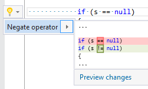

## Invert operator

| Property           | Value                             |
| ------------------ | --------------------------------- |
| Id                 | RR0082                            |
| Title              | Invert operator                   |
| Syntax             | \!=, &&, \|\|, \<, \<=, ==, >, >= |
| Enabled by Default | &#x2713;                          |

### Usage

## Related Source Files

* [BinaryExpressionRefactoring.cs](../../src/Refactorings/CSharp/Refactorings/BinaryExpressionRefactoring.cs)

## See Also

* [Full list of refactorings](Refactorings.md)

*\(Generated with [DotMarkdown](http://github.com/JosefPihrt/DotMarkdown)\)*